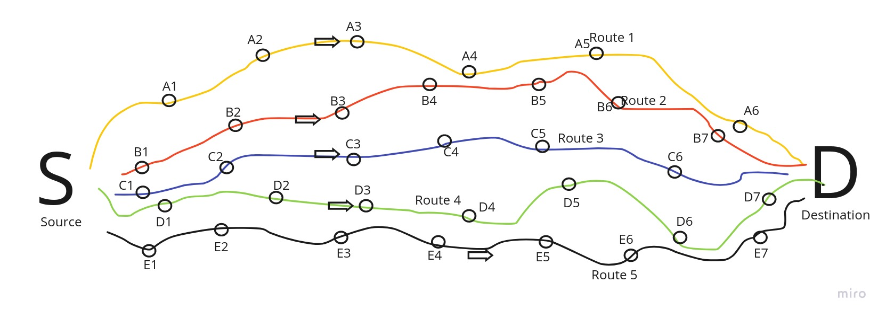

# Most Representative Routes

This repository contains an experiment to find the most representative route from a large data set of routes between two specific ports.

## How it works?



Suppose there is Source (S), Destination (D), and routes (A, B, C, D, E). To find an average or a representative path between S -> D, we take the everage of points, e.g,
```shell
Point1x = (A1x + B1x + C1x + D1x + E1x)/5
Point1y = (A1y + B1y + C1y + D1y + E1y)/5

Average Point 1 = (Point1x, Point1y)
```

## Technologies

- Java 17
- Spring Boot 2.6.4
- Maven

## How to run it locally?

```shell
./mvnw spring-boot:run
```

## How to dockerized it?

```shell
./mvnw spring-boot:build-image
```

## CI/CD Locally

To run the CI/CD locally:
```shell
./cicd-locally.sh
```
It first builds the docker images out of the application, then push to the public docker registry, and then run the container using `Docker Compose`.